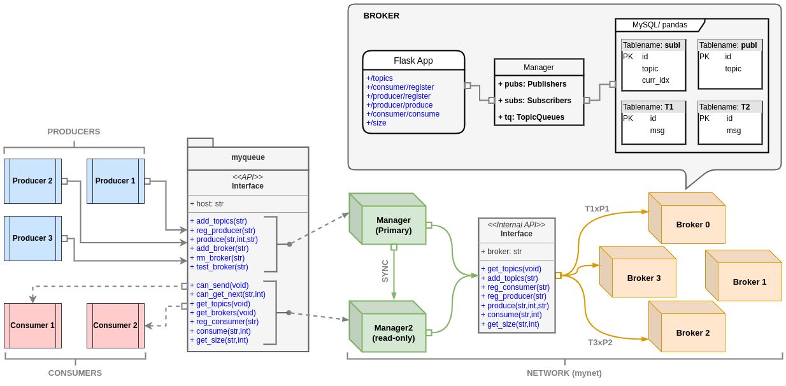
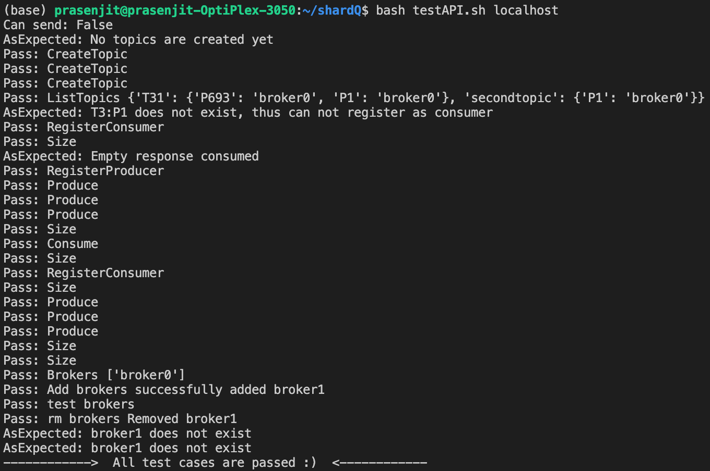
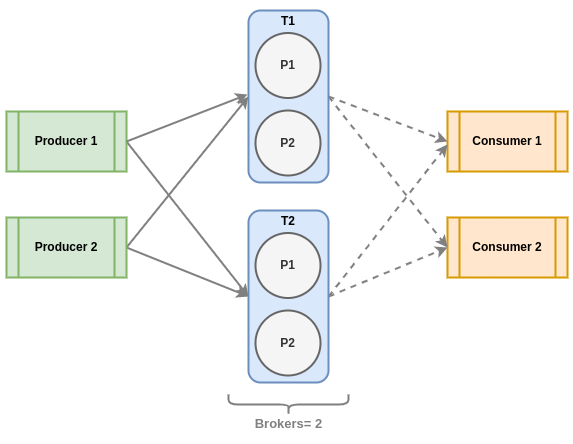
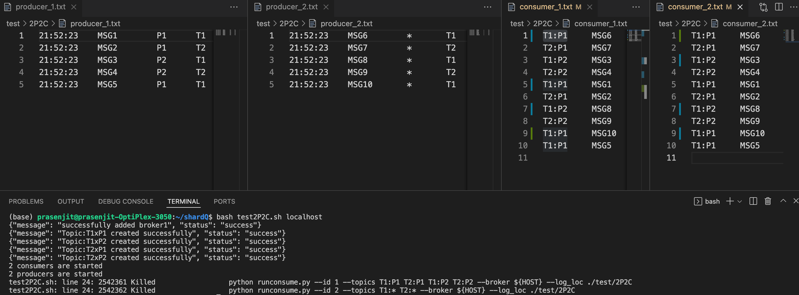
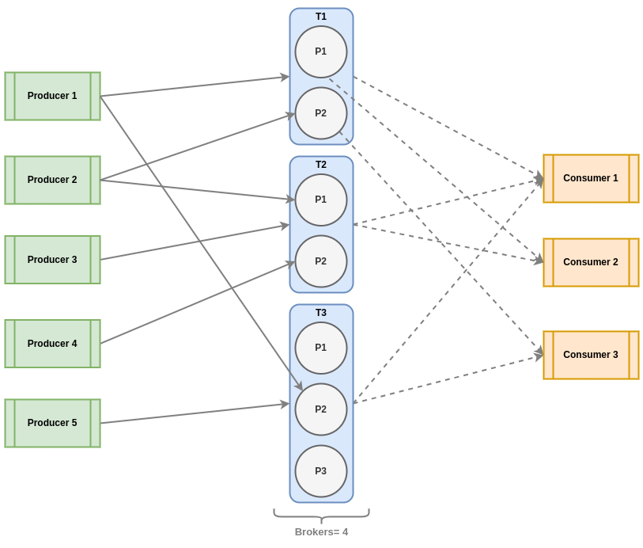
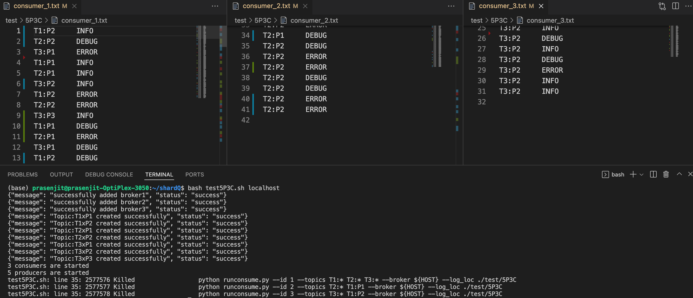

# Distributed Queue with sharding

       <strong>Fig.1: Overview</strong>

# Design

The repository implements a distributed logging queue with sharding in Python programming language and provides HTTP endpoints to interact with it over the network. It uses the Flask library to register the endpoints and further uses a Manager object to interact with the broker-cluster to access the distributed storage. The storage layer tracks tables for all topics and their shards (partitions) along with subscribers (consumer) and publishers (producer) that are using the Manager to pass messages to some broker in the cluster under a specific topic. The table schemas are shown in Fig.1.

The Manager object has two replicas:
<ol type="i">
 <li><strong>Primary</strong> Manager is responsible to perform any amendments in the broker-cluster such as adding new or removing old brokers, creating topics and allow Producers to register and publish messages to any topic or specific shard of a topic.</li>
 <li><strong>Read-only</strong> Manager is taking care of all read calls to the broker-cluster such as list of live-brokers, list of topics and their shard’s location. Moreover it allows Consumers to register to any topic or specific shard of the topic and consume messages. Note that, read-only manager query the primary manager to synchronise with the cluster configuration.</li>
</ol>

On top of the Managers and the distributed broker-cluster, a python library “myqueue” is implemented that provides the MyProducer, MyConsumer classes to easily create respective instances. Moreover an ApiHandler is also implemented to interact with the Managers from the python environment. The producer and consumer instances can concurrently send or receive data from the Managers. However, internally the brokers order the requests and accordingly store the messages in the storage layer using locking primitives like Semaphore and ThreadPool.

# Assumptions

+ Topics should not have “–”, “@”, “x”, "*", “|”, “:” in their name (i.e., T–1 is not allowed, T1 is allowed) as they are being used internally by the managers and brokers to store combined representation of subscriptions.
+ “subl” and “publ” names are reserved for the broker's internal use. Hence usage of these two for topic names is prohibited.
+ The log files are of specified format to work with the “myqueue” implementation. This is discussed in detail in the testing phase.
+ Producer and Consumer IDs start from 0 to N for each type of instance. For instance the first producer will have ID as 0 and first consumer will also have ID as 0; however these two are used in different contexts and are not the same.
+ Consumers start consuming messages when they subscribe to a topic. Please note previous messages are not accessible for the consumer instance.
+ Internal ordering of the messages is based on FIFS policy. Hence whichever request comes first, is served first. Unless it is parallelizable (i.e., read calls).
+ When adding a new broker to the broker-cluster, the broker name must contain the keyword “broker” (e.g., broker0) to distinguish it inside the docker network.
+ Shards/ Partitions are assigned to the brokers with a random-policy, thus it ensures probabilistic equal contribution in terms of storage from each broker.
+ Providing only Topic and not which shard/partition (* is the wildcard) to register results in round-robin access to all the partitions of the topic.
+ Need to wait for sometime(i.e., 20 secs) to let a newly added broker initialize and start functioning in the broker-cluster.

# Challenges

+ Designing the schemas for the tables was a bit challenging. Especially how to design them so that it takes minimum space and it will be easy from the broker’s perspective to interact with the storage-layer.
+ MySQL database supports sequential query processing. Therefore, the concurrent requests from the producer and consumer objects poses a great issue. This leads to multiple failed attempts to test the persistent version of the broker. Eventually, the implementation synchronous Process Pool of size 1 to make the SQL queries sequential.
+ However, the above design choice may increase the latency for each request to be served.
+ Finding a way to spawn new docker containers (brokers in the cluster) in the host computer from another privileged container (Primary Manager) was bit hectic
+ Testing the implementation from every aspect was challenging and helped fixing some major bugs in the "myqueue" python library.

# Prerequisites

### 1. Docker: latest [version 20.10.23, build 7155243]

    sudo apt-get update

    sudo apt-get install \
        ca-certificates \
        curl \
        gnupg \
        lsb-release

    sudo mkdir -p /etc/apt/keyrings
    curl -fsSL https://download.docker.com/linux/ubuntu/gpg | sudo gpg --dearmor -o /etc/apt/keyrings/docker.gpg

    echo \
    "deb [arch=$(dpkg --print-architecture) signed-by=/etc/apt/keyrings/docker.gpg] https://download.docker.com/linux/ubuntu \
    $(lsb_release -cs) stable" | sudo tee /etc/apt/sources.list.d/docker.list > /dev/null

    sudo apt-get update

    sudo apt-get install docker-ce docker-ce-cli containerd.io

### 2. Docker-compose standalone [version v2.15.1]
    sudo curl -SL https://github.com/docker/compose/releases/download/v2.15.1/docker-compose-linux-x86_64 -o /usr/local/bin/docker-compose
    
    sudo chmod +x /usr/local/bin/docker-compose
    
    sudo ln -s /usr/local/bin/docker-compose /usr/bin/docker-compose

# Installation Steps

### Deploy broker-cluster 
    persistent mode
    └── make persist

    inMemory mode
    └── make inmem

### Restart broker-cluster 
    make restart

### Remove broker-cluster
    remove all & keep cache
    └── make clean

    remove all & remove cache
    └── make prune

# Testing
Here 10.110.10.216 is used as an examle broker-cluster instance.

### run a producer instance from log file
    COMMAND
    └──python runproduce.py --id 1 --topics T1:P1 T2:P2 T3:* --broker 10.110.10.216 --log_loc ./test/{EXP}

** producer_{id}.txt log file format must be maintained else throws <strong>Exception("log file:incompitable")</strong>

|ts|msg|parallel|topic|
|---|---|---|---|
|21:52:23|INFO|	*|T1|
|21:52:23|INFO|	P2|T3|
|21:52:23|INFO|	*|T1|
|21:52:23|INFO|	P2|T3|
|21:52:23|INFO|	*|T1|
|21:52:23|INFO|	P2|T3|

### run a consumer instance and store log
    COMMAND
    └──python runconsume.py --id 1 --topics T1:* T2:P1 --broker 10.110.10.216 --log_loc ./test/{EXP}

** consumer_{id}.txt stored log file example 

|topic:part|msg|
|---|---|
|T2:P1|DEBUG|
|T3:P1|ERROR|
|T1:P2|INFO|
|T2:P2|ERROR|
|T3:P2|INFO|
### run API test cases
    COMMAND
    └──bash testAPI.sh 10.110.10.216

Test results are as follows

      

       <strong>Fig.2: 2 Producers 2 Consumers</strong>

### run 2-producer, 2-consumer setup
Question: Implement 2 Producers and 2 consumers with 2 topics T1 & T2 each having partitions as shown in Fig. 2 using the library developed. Given below is the "topic (partition):producers:consumers" mapping.

+ T1(P1): Producer1 Producer2: Consumer1 Consumer2
+ T1(P2): Producer1 Producer2: Consumer1 Consumer2
+ T2(P1): Producer1 Producer2: Consumer1 Consumer2
+ T2(P2): Producer1 Producer2: Consumer1 Consumer2

Here, the last point means that Producer1 and Producer2 will produce to topic T2 partition P2;  Consumer1, Consumer2 will consume from T2 partition P2.

    [Producers]
    └──python runproduce.py --id 1 --topics T1:P1 T2:P1 T1:P2 T2:P2 --broker  10.110.10.216 --log_loc ./test/2P2C
    └──python runproduce.py --id 2 --topics T1:* T2:* --broker  10.110.10.216 --log_loc ./test/2P2C

    [Consumers]
    └──python runconsume.py --id 1 --topics T1:P1 T2:P1 T1:P2 T2:P2 --broker  10.110.10.216 --log_loc ./test/2P2C
    └──python runconsume.py --id 2 --topics T1:* T2:* --broker  10.110.10.216 --log_loc ./test/2P2C

    Run all commands together
    -------------------------
    + bash test2P2C.sh 10.110.10.216

Test results are as follows and Consumer logs are stored at <strong>./test/2P2C/consumer_{id}.txt</strong> where id = 1,2

      

       <strong>Fig.3: 5 Producers 3 Consumers</strong>

### run 5-producer, 3-consumer setup
Question: Implement 5 Producers and 3 consumers with 3 topics T1, T2 & T3 each having partitions as shown in Fig. 3 using the library developed. Given below is the "topic (partition):producers:consumers" mapping.

+ T1(P1): Producer1: Consumer1 Consumer2
+ T1(P2): Producer1 Producer2: Consumer1 Consumer3
+ T2(P1): Producer2 Producer3: Consumer1 Consumer3 
+ T2(P2): Producer3 Producer4: Consumer1 Consumer2 
+ T3(P1): Producer5: Consumer1 Consumer3
+ T3(P2): Producer1 Producer5: Consumer1 Consumer3
+ T3(P3): Producer5: Consumer1 Consumer3

Here, the last point means that Producer5 will produce to topic T3 partition P3;  Consumer1, Consumer3 will consume from T3 partition P3.

    [Producers]
    └──python runproduce.py --id 1 --topics T1:* T3:P2 --broker  10.110.10.216 --log_loc ./test/5P3C
    └──python runproduce.py --id 2 --topics T1:P2 T2:P1 --broker  10.110.10.216 --log_loc ./test/5P3C
    └──python runproduce.py --id 3 --topics T2:* --broker  10.110.10.216 --log_loc ./test/5P3C
    └──python runproduce.py --id 4 --topics T2:P2 --broker  10.110.10.216 --log_loc ./test/5P3C
    └──python runproduce.py --id 5 --topics T3:* --broker  10.110.10.216 --log_loc ./test/5P3C

    [Consumers]
    └──python runconsume.py --id 1 --topics T1:* T2:* T3:* --broker  10.110.10.216 --log_loc ./test/5P3C
    └──python runconsume.py --id 2 --topics T2:* T1:P1 --broker  10.110.10.216 --log_loc ./test/5P3C
    └──python runconsume.py --id 3 --topics T3:* T1:P2 --broker  10.110.10.216 --log_loc ./test/5P3C

    Run all commands together
    -------------------------
    + bash test5P3C.sh 10.110.10.216

Test results are as follows and Consumer logs are stored at <strong>./test/5P3C/consumer_{id}.txt</strong> where id = 1,2,3

      

# Contact Me

This is Assignment 2 of CS60002: Distributed Systems course in IIT Kharagpur, taught by [Dr. Sandip Chakraborty](https://cse.iitkgp.ac.in/~sandipc/). For questions and general feedback, contact [Prasenjit Karmakar](https://www.linkedin.com/in/prasenjit52282). [Assignment 1](https://github.com/prasenjit52282/distributedQ) was on implementing a centralized broker and was much simpler to understand for me.